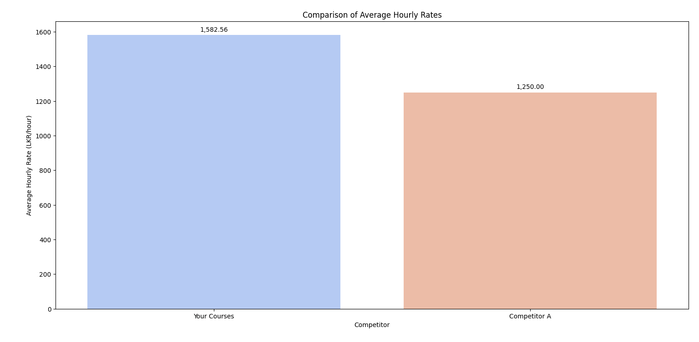

# Little Coders Documentation

## 1. The Dataset

The dataset used for this analysis is loaded from the Excel file located at `../Dataset/Updated_Dataset.xlsx`, specifically from the sheet named `Cleaned dataset`.

```python
import pandas as pd

# Load the dataset from the specific sheet "Cleaned dataset"
dataset_path = '../Dataset/Updated_Dataset.xlsx'
df = pd.read_excel(dataset_path, sheet_name='Cleaned dataset')

# Display the first few rows of the dataset
df.head()
```

This dataset contains details about various coding courses available in Sri Lanka for 11-16-year-olds. The relevant columns include `Course name`, `Age Group`, `Features`, `Duration`, `Registration fee`, `Course fee`, `Payment Method for course fee`, and `Delivery method`.

## 2. Data Cleaning and Formatting

### 2.1 Removing Outliers

We identified and removed outlier rows to ensure the accuracy of our analysis. Specifically, the 1st row (index 0), 10th row (index 9), and 14th row (index 13) were removed.

```python
# Remove the outlier rows
df_cleaned = df.drop([0, 9, 13])

# Reset the index after dropping rows, starting from 1
df_cleaned.reset_index(drop=True, inplace=True)
df_cleaned.index += 1
```

### 2.2 Transforming the `Age Group` Column

The `Age Group` column was transformed to a more standardized format. Age groups were converted from ranges like `11-16` to strings like `11-16`, and ages with a `+` sign were transformed to ranges.

```python
import numpy as np

# Transform Age Group column
def transform_age_group(age_group):
    if pd.isna(age_group):
        return np.nan
    if '+' in age_group:
        min_age = int(age_group.replace('+', '').strip())
        return f"{min_age}-"
    min_age, max_age = map(int, age_group.split('-'))
    return f"{min_age}-{max_age}"

df_cleaned['Age Group'] = df_cleaned['Age Group'].apply(transform_age_group)
```

### 2.3 Converting Numeric Columns

Columns such as `Duration`, `Registration fee`, and `Course fee` were converted to numeric types to facilitate further analysis.

```python
# Convert Duration, Registration fee, and Course fee columns to numeric
df_cleaned['Duration'] = pd.to_numeric(df_cleaned['Duration'], errors='coerce')
df_cleaned['Registration fee'] = pd.to_numeric(df_cleaned['Registration fee'], errors='coerce')
df_cleaned['Course fee'] = pd.to_numeric(df_cleaned['Course fee'], errors='coerce')
```

### 2.4 Handling Missing Values

All occurrences of `"NA"` in both text and numeric columns were replaced with `NaN` for consistency.

```python
# Replace "NA" with NaN in both text and numeric columns
df_cleaned.replace("NA", np.nan, inplace=True)
```

After cleaning and formatting, we focused on the following columns for analysis:

```python
# Display only the necessary columns
columns_to_display = ['Course name', 'Age Group', 'Features', 'Duration', 'Registration fee', 'Course fee', 'Payment Method for course fee', 'Delivery method']
df_cleaned[columns_to_display]
```

## 3. Demographic Insight
- To Analyze the target demographics for each course to understand the primary audience.

### 3.1 Extracting Minimum and Maximum Ages

To analyze the age distribution for each course, we extracted the minimum and maximum ages from the `Age Group` column. This involved parsing the age ranges and handling cases where only a minimum age was specified.

```python
# Extract minimum and maximum ages from the 'Age Group' column
df_cleaned['Min_Age'] = df_cleaned['Age Group'].str.extract(r'(\d+)', expand=False).astype(float)
df_cleaned['Max_Age'] = df_cleaned['Age Group'].str.extract(r'(\d+)\+?-(\d+)', expand=False)[1].fillna(df_cleaned['Min_Age']).astype(float)
```

### 3.2 Summary Statistics for Ages

We computed summary statistics for the minimum and maximum ages to understand the range and central tendency of age groups across the courses.

**Summary statistics for Minimum Age:**

```
count    17.000000
mean     10.117647
std       1.932691
min       6.000000
25%       9.000000
50%      10.000000
75%      11.000000
max      14.000000
Name: Min_Age, dtype: float64
```

**Summary statistics for Maximum Age:**

```
count    17.000000
mean     13.823529
std       2.505875
min      10.000000
25%      12.000000
50%      14.000000
75%      16.000000
max      17.000000
Name: Max_Age, dtype: float64
```

### 3.3 Visualizing Age Distribution

We visualized the age distribution of the courses to see how age ranges vary and identify the most common age ranges. The plot includes lines representing the age range for each course and highlights the most common age range.


_Description:_ The plot shows the age distribution for each course, with lines indicating the range from minimum to maximum ages. The most common age range is highlighted, and horizontal lines indicate the most common minimum and maximum ages.

Here the most courses are designed for children between 10 and 16 years old. This indicates that the primary audience for these coding courses is pre-teens and teenagers. 

 
## 4. Curriculum and Features Insight
- To understand which coding languages and topics are most commonly taught and identify the unique features of each course.

### 4.1 Splitting Features into Individual Items

We began by splitting the `Features` column into individual items for detailed analysis.

```python
# Split Features into individual items
features_split = df_cleaned['Features'].str.split(', ', expand=True).stack()
features_df = pd.DataFrame(features_split, columns=['Feature'])
features_count = features_df['Feature'].value_counts().reset_index()
features_count.columns = ['Feature', 'Count']
```

### 4.2 Top 12 Most Common Features

To understand which features are most prevalent, we identified the top 12 most common features and visualized them.

```python
# Get the top 12 most common features
top_features = features_count.head(12)

# Plot the top 12 most common features
import matplotlib.pyplot as plt
import seaborn as sns

plt.figure(figsize=(10, 8))
sns.barplot(x='Count', y='Feature', data=top_features, palette='Blues_d')

# Add labels to bars
for index, value in enumerate(top_features['Count']):
    plt.text(value, index, str(value), va='center', ha='left', fontsize=10)

plt.xlabel('Count')
plt.ylabel('Features')
plt.title('Top 12 Most Common Features in Coding Courses')
plt.tight_layout()
plt.show()
```


_Description:_ The plot shows the top 12 most common features across coding courses, highlighting their frequencies.

### 4.3 Identifying Unique Features

We also identified features that appear only once across all courses to understand unique aspects of course offerings.

```python
# Count the frequency of each feature
feature_count = features_count

# Identify unique features (appearing only once)
unique_features = feature_count[feature_count['Count'] == 1]

# Print unique features
print("Unique Features:")
print(unique_features)
```

**Unique Features:**

```
Unique Features: 
| Feature                               | Count |
|---------------------------------------|-------|
| Academia                              | 1     |
| AI                                    | 1     |
| Animation                             | 1     |
| App Design                            | 1     |
| App Inventor                          | 1     |
| Astronomy                             | 1     |
| Basic Electronics                     | 1     |
| Bioinformatics                        | 1     |
| CSS Transition                        | 1     |
| Classes                               | 1     |
| Computer Science                      | 1     |
| Computer science concepts             | 1     |
| Computational concepts                | 1     |
| Data Analytics                        | 1     |
| Data Mining                           | 1     |
| Designing                             | 1     |
| Electronics                           | 1     |
| Ethics in AI                          | 1     |
| Finance                               | 1     |
| Flexbox                               | 1     |
| Files and Resource Management         | 1     |
| Game development                      | 1     |
| Gaming project                        | 1     |
| Grid Layouts                          | 1     |
| Hands on Making                       | 1     |
| Handling exceptions                   | 1     |
| Iterables                             | 1     |
| Logic of programming                  | 1     |
| Mathematics                           | 1     |
| Micro-controller interface            | 1     |
| Microbit                              | 1     |
| Mobile App Development                | 1     |
| Modularity, Objects                   | 1     |
| MySQL                                 | 1     |
| Networking & Cyber Security           | 1     |
| Overlays, Build responsive Layout     | 1     |
| PictoBlox                             | 1     |
| PHP                                   | 1     |
| Programming ChatBots                  | 1     |
| Prototyping                           | 1     |
| Python Programming                    | 1     |
| Research                              | 1     |
| Software Engineering                  | 1     |
| Speech Recognition                    | 1     |
| UI/UX components                      | 1     |
| VB.NET                                | 1     |
| Visual Basic .NET                     | 1     |
...
```

The most commonly taught topics across coding courses in Sri Lanka for 11-16-year-olds are Python, Scratch, and HTML/CSS. These languages and tools appear frequently, indicating a strong focus on foundational programming and web development skills. 

Additionally, there are unique features, such as AI, App Design, and App Development, which are only offered in one course each, highlighting specialized areas not commonly covered in other programs.


## 5. Price Insight
- To analyze the cost structure of coding courses, including registration fees, monthly fees, and total costs.

### 5.1 Calculating Hourly Rate per Course

To analyze the pricing of the courses, we calculated the hourly rate by dividing the `Course fee` by the `Duration`.

```python
# Calculate the hourly rate per course
df_cleaned['Hourly Rate (LKR)'] = df_cleaned['Course fee'] / df_cleaned['Duration']
```

### 5.2 Plotting the Hourly Rate

We visualized the hourly rate for each course to gain insights into the pricing structure across different courses.


_Description:_ The plot displays the hourly rate for each course, allowing us to identify any significant differences in pricing.

### 5.3 Calculating the Average Hourly Rate

Finally, we calculated the average hourly rate across all courses.

```python
# Calculate the average hourly rate
average_hourly_rate = df_cleaned['Hourly Rate (LKR)'].mean()

# Print the average hourly rate
print(f"The average hourly rate for the courses is: {average_hourly_rate:.2f} LKR")
```

**Average Hourly Rate:**

```
The average hourly rate for the courses is: 1582.56 LKR
```

### 5.4 Handling Missing Values and Converting to Numeric

We replaced `"NA"` values with `0` and converted the `Registration fee` and `Course fee` columns to numeric types for analysis.

```python
# Replace 'NA' values with 0 and convert to numeric
df_cleaned['Registration fee'] = pd.to_numeric(df_cleaned['Registration fee'], errors='coerce').fillna(0)
df_cleaned['Course fee'] = pd.to_numeric(df_cleaned['Course fee'], errors='coerce').fillna(0)
```

### 5.5 Histograms of Registration and Course Fees

We created histograms to visualize the distribution of registration and course fees across the courses.

#### Histogram of Registration Fees

```python
# Histogram of Registration Fees
import matplotlib.pyplot as plt
import seaborn as sns

plt.figure(figsize=(10, 6))
sns.histplot(df_cleaned['Registration fee'], bins=30, color='skyblue', edgecolor='black')
plt.xlabel('Registration Fee (LKR)')
plt.ylabel('Count')
plt.title('Distribution of Registration Fees')
plt.xscale('linear')
plt.yscale('linear')
plt.tight_layout()
plt.show()
```


_Description:_ The histogram shows the distribution of registration fees, highlighting the frequency of different fee ranges.

#### Histogram of Course Fees

```python
# Histogram of Course Fees
plt.figure(figsize=(10, 6))
sns.histplot(df_cleaned['Course fee'], bins=30, color='lightgreen', edgecolor='black')
plt.xlabel('Course Fee (LKR)')
plt.ylabel('Count')
plt.title('Distribution of Course Fees')
plt.xscale('linear')
plt.yscale('linear')
plt.tight_layout()
plt.show()
```


_Description:_ The histogram illustrates the distribution of course fees, providing insights into the variation in pricing.

### 5.6 Summary Statistics for Registration and Course Fees

We calculated summary statistics for the registration and course fees, excluding zero values to ensure accuracy.

```python
# Filter out zero values for summary statistics
non_zero_reg_fees = df_cleaned['Registration fee'][df_cleaned['Registration fee'] > 0]
non_zero_course_fees = df_cleaned['Course fee'][df_cleaned['Course fee'] > 0]

# Calculate summary statistics for Registration Fees
max_reg_fee = non_zero_reg_fees.max()
min_reg_fee = non_zero_reg_fees.min()
common_reg_fee_range = f"{non_zero_reg_fees.quantile(0.25):,.0f} - {non_zero_reg_fees.quantile(0.75):,.0f}"

# Calculate summary statistics for Course Fees
max_course_fee = non_zero_course_fees.max()
min_course_fee = non_zero_course_fees.min()
common_course_fee_range = f"{non_zero_course_fees.quantile(0.25):,.0f} - {non_zero_course_fees.quantile(0.75):,.0f}"

# Create a summary statistics table
summary_stats = pd.DataFrame({
    'Statistic': ['Max', 'Min', 'Common Range (25th-75th Percentile)'],
    'Registration Fees': [f"{max_reg_fee:,.0f}", f"{min_reg_fee:,.0f}", common_reg_fee_range],
    'Course Fees': [f"{max_course_fee:,.0f}", f"{min_course_fee:,.0f}", common_course_fee_range]
})

print("Summary Statistics for Registration and Course Fees (excluding zeros):")
print(summary_stats)
```

**Summary Statistics for Registration and Course Fees (excluding zeros):**

| Statistic                           | Registration Fees | Course Fees |
|-------------------------------------|-------------------|-------------|
| Max                                 | 10,000            | 304,000     |
| Min                                 | 5,000             | 12,000      |
| Common Range (25th-75th Percentile) | 8,750 - 10,000    | 47,000 - 60,000 |

Most of the coding courses do not have registration fees. 
For those that do, the registration fees range from LKR 5,000 to LKR 10,000, with the most common range being between LKR 8,750 and LKR 10,000. 

Course fees vary more widely, from LKR 12,000 to LKR 304,000, with the most common fees falling between LKR 47,000 and LKR 60,000.


## 6. Duration Insight
- To Analyze the duration and intensity of courses to understand the commitment required from students.

### 6.1 Convert Duration to Numeric

We converted the `Duration` column to numeric values to ensure accurate analysis.

```python
# Convert 'Duration' to numeric
df_cleaned['Duration'] = pd.to_numeric(df_cleaned['Duration'], errors='coerce')
```

### 6.2 Summary Statistics for Course Duration

We calculated the summary statistics for course duration to understand its distribution.

```python
# Summary statistics for course duration
duration_summary = df_cleaned['Duration'].describe()
print("Summary Statistics for Course Duration:")
print(duration_summary)
```

**Summary Statistics for Course Duration:**

| Statistic | Value |
|-----------|-------|
| Count      | 16.0  |
| Mean       | 53.5  |
| Std Dev    | 55.43 |
| Min        | 20.0  |
| 25th %ile  | 24.0  |
| Median     | 30.0  |
| 75th %ile  | 50.0  |
| Max        | 192.0 |

### 6.3 Bar Plot for Course Duration by Course Name

```python
# Bar plot for course duration by course name
import matplotlib.pyplot as plt
import seaborn as sns

plt.figure(figsize=(12, 8))
sns.barplot(data=df_cleaned, y='Course name', x='Duration')
plt.xlabel('Duration (hours)')
plt.ylabel('Course Name')
plt.title('Course Duration for Each Course')
plt.tight_layout()
plt.show()
```


_Description:_ The bar plot displays the duration of each course, allowing comparison of course lengths.

- The course durations range from 20 to 192 hours.
- Most courses fall between 25 and 50 hours, with an average duration of 53.5 hours.
- There is one outlier course lasting nearly 200 hours.

### 6.4 Box Plot for Distribution of Course Durations

```python
# Box plot for distribution of course durations
plt.figure(figsize=(10, 6))
sns.boxplot(x=df_cleaned['Duration'], color='lightblue')
plt.xlabel('Duration (hours)')
plt.title('Distribution of Course Durations')
plt.tight_layout()
plt.show()
```


_Description:_ The box plot visualizes the distribution of course durations, highlighting the spread and any potential outliers.

- The majority of courses last between 25 and 50 hours.
- A few courses are shorter, while one is significantly longer.
  
### 6.5 Scatter Plot with Regression Line

```python
# Scatter plot with regression line
plt.figure(figsize=(10, 6))
sns.scatterplot(data=df_cleaned, x='Duration', y='Course fee', color='darkgreen')
sns.regplot(data=df_cleaned, x='Duration', y='Course fee', scatter=False, color='red')
plt.xlabel('Duration (hours)')
plt.ylabel('Course Fee (LKR)')
plt.title('Course Duration vs Course Fee')
plt.tight_layout()
plt.show()
```


_Description:_ The scatter plot with a regression line shows the relationship between course duration and course fee, indicating how duration affects pricing.

- There is a positive correlation between course duration and course fee, indicating that longer courses tend to be more expensive.


### 6.6 Box Plot for Course Duration by Delivery Method

```python
# Box plot for course duration by delivery method
plt.figure(figsize=(12, 8))
sns.boxplot(data=df_cleaned, x='Delivery method', y='Duration', palette='Set2')
plt.xlabel('Delivery Method')
plt.ylabel('Duration (hours)')
plt.title('Course Duration by Delivery Method')
plt.tight_layout()
plt.show()
```


_Description:_ The box plot illustrates the distribution of course durations based on different delivery methods, providing insights into how the method influences duration.

- Hybrid Courses: Generally longer, with most lasting between 50 and 100 hours. There is one course extending up to 200 hours.

- Online Courses: Typically shorter, with most lasting around 5 to 10 hours


## 7. Delivery Method Insight
- To compare the coding products with similar offerings in the market and identify unique selling points or gaps in the market

### 7.1 Distribution of Delivery Methods

We analyzed the distribution of courses by their delivery method using a pie chart.

```python
# Count courses by delivery method
delivery_count = df_cleaned['Delivery method'].value_counts()

# Create a pie chart
import matplotlib.pyplot as plt

plt.figure(figsize=(8, 8))
plt.pie(delivery_count, labels=delivery_count.index, autopct='%1.1f%%', colors=plt.cm.Paired(range(len(delivery_count))))
plt.title('Distribution of Delivery Methods')
plt.tight_layout()
plt.show()
```


_Description:_ The pie chart shows the proportion of courses offered through different delivery methods, highlighting the most and least common methods.

The pie chart shows that most coding courses are offered through hybrid methods, with only a few available online.

### 7.2 Number of Courses and Average Fee by Delivery Method

We compared the number of courses and their average fees for each delivery method using a stacked bar chart.

```python
# Calculate the average course fee by delivery method
avg_fee_by_delivery = df_cleaned.groupby('Delivery method')['Course fee'].mean().reset_index()
avg_fee_by_delivery.columns = ['Delivery method', 'Average Fee']

# Count courses by delivery method (already done above)
delivery_count_df = delivery_count.reset_index()
delivery_count_df.columns = ['Delivery method', 'Number of Courses']

# Merge with the average fee data
delivery_summary = pd.merge(delivery_count_df, avg_fee_by_delivery, on='Delivery method')

# Create a stacked bar chart
import seaborn as sns

plt.figure(figsize=(12, 8))
sns.barplot(data=delivery_summary, x='Delivery method', y='Number of Courses', palette='Set2', hue='Delivery method')

# Add average fee labels
for i in range(len(delivery_summary)):
    plt.text(x=i, y=delivery_summary['Number of Courses'].iloc[i] + 0.5, 
             s=f"Avg Fee: {delivery_summary['Average Fee'].iloc[i]:,.0f}", 
             ha='center', va='bottom')

plt.xlabel('Delivery Method')
plt.ylabel('Number of Courses')
plt.title('Number of Courses and Average Fee by Delivery Method')
plt.legend(title='Delivery Method', bbox_to_anchor=(1.05, 1), loc='upper left')
plt.tight_layout()
plt.show()
```


_Description:_ The stacked bar chart illustrates the number of courses and the average fee for each delivery method, offering insights into the cost and quantity associated with different delivery methods.

The stacked bar chart reveals that:
- Hybrid Courses: There are over 10 courses with an average fee of 87,714.
- Online Courses: There are around 5 courses with a significantly lower average fee of 18,000.
This suggests that hybrid courses are more come at a higher cost compared to online courses.


## 8. Payment Method Insight

### 8.1 Distribution of Payment Methods for Course Fees

We analyzed the distribution of payment methods used for course fees. The bar plot below shows the frequency of each payment method.

```python
# Count the occurrences of each payment method
payment_method_count = df_cleaned['Payment Method for course fee'].value_counts()

# Create a DataFrame for visualization
payment_method_df = payment_method_count.reset_index()
payment_method_df.columns = ['Payment Method', 'Count']

# Create a bar plot for payment methods
import matplotlib.pyplot as plt
import seaborn as sns

plt.figure(figsize=(10, 6))
sns.barplot(data=payment_method_df, x='Payment Method', y='Count', palette='viridis')

# Add labels to the bars
for index, row in payment_method_df.iterrows():
    plt.text(index, row['Count'] + 0.5, row['Count'], ha='center')

plt.xlabel('Payment Method')
plt.ylabel('Count')
plt.title('Distribution of Payment Methods for Course Fees')

# Rotate the x-axis labels and add padding
plt.xticks(rotation=45, ha='right', rotation_mode='anchor')

# Adjust layout to prevent label cut-off
plt.tight_layout()

plt.show()
```


_Description:_ The bar plot illustrates the distribution of different payment methods used for course fees, showing how frequently each method is utilized.


## 9. Comparing with Hypothetical Competitor

Let's assume for "Competitor A" course, the average course fee is Rs.50,000, and the average course duration is 40 hours.

The following code compares the average hourly rates between your courses and those of Competitor A.

```python
 
# Calculate the average hourly rate for our courses
df_cleaned['Hourly Rate'] = df_cleaned['Course fee'] / df_cleaned['Duration']
avg_hourly_rate_your_courses = df_cleaned['Hourly Rate'].mean()

# Hypothetical competitor data
competitor_data = {
    "Competitor": ["Competitor A"],
    "avg_hourly_rate": [50000 / 40]  # Competitor A's course fee divided by its duration
}

competitor_df = pd.DataFrame(competitor_data)

# Combine your data with competitor data
your_courses_data = pd.DataFrame({
    "Competitor": ["Your Courses"],
    "avg_hourly_rate": [avg_hourly_rate_your_courses]
})

combined_data = pd.concat([your_courses_data, competitor_df]).reset_index(drop=True)

# Plotting comparison for average hourly rates
plt.figure(figsize=(10, 6))
ax = sns.barplot(data=combined_data, x='Competitor', y='avg_hourly_rate', palette='coolwarm')

# Add labels to the bars
for index, row in combined_data.iterrows():
    ax.text(index, row['avg_hourly_rate'] + 20, f"{row['avg_hourly_rate']:,.2f}", ha='center')

plt.xlabel('Competitor')
plt.ylabel('Average Hourly Rate (LKR/hour)')
plt.title('Comparison of Average Hourly Rates')
plt.tight_layout()

plt.show()
```

The plots below show how these courses' average hourly rates compare to those of Competitor A. This visual comparison helps highlight differences in pricing and course length between these offerings and those of a competitor.




 
## 10. Experiment Proposal: Comparing the Effectiveness of Our Coding Product vs. Competitor's Product 

The goal of this experiment is to determine whether our coding product or the competitor's product is more effective in teaching coding skills to students.
### Experiment Design

#### 1. Participant Selection

Select 20 students from the same classroom. All students should be of the same age and have a similar level of prior coding knowledge to ensure a fair comparison.

#### 2. Initial Assessment

Before the learning phase, administer a coding test to all 20 students to assess their current coding skills. Record the test results for each student.

#### 3. Group Division

- Divide the students into two groups of 10 students each.
- **Group A** will use our coding product for learning.
- **Group B** will use the competitor's coding product.

#### 4. Learning Phase

Provide both groups with sufficient time to learn coding using their respective products. Ensure that the learning conditions are the same for both groups (e.g., time spent learning, access to resources, etc.).

#### 5. Post-Learning Assessment

After the learning phase, administer the same coding test to both groups. Record the test results for each student again.

#### 6. Data Analysis

Compare the test results before and after the learning phase for both groups. Analyze the improvement in coding skills for each group to determine which product led to greater progress.

#### 7. Conclusion

The results will show whether our coding product or the competitor's product is more effective in improving coding skills among students.

### Key Points for Explanation

- The experiment is designed to be fair, with both groups starting at the same level.
- The use of pre- and post-tests allows us to measure the exact improvement in skills.
- By comparing the results, we can make an informed decision about which product is better.

